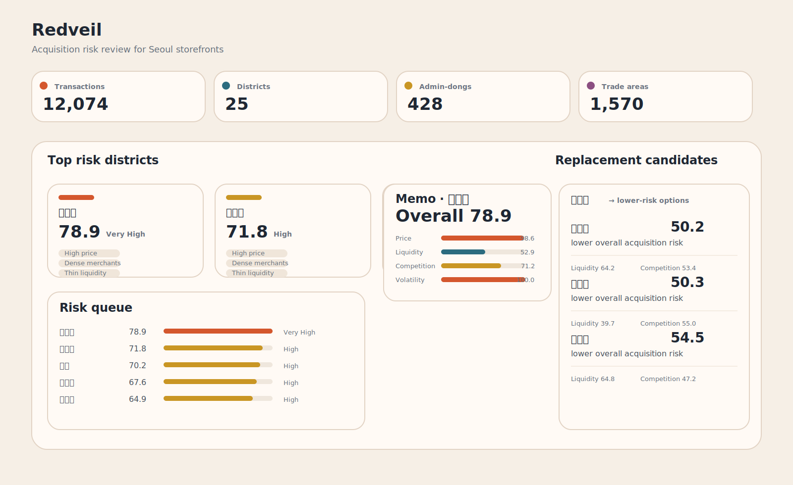
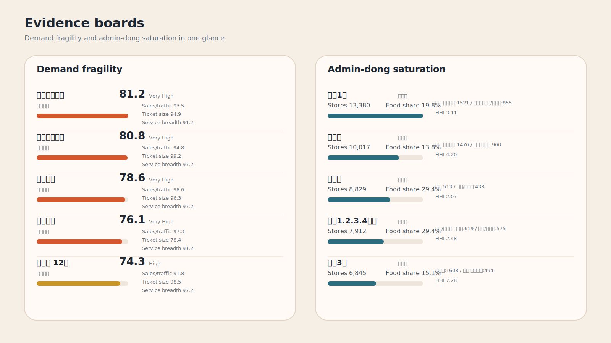

# Redveil

서울 소형 상가 매입 전에 공실 위험, 거래 둔화, 상권 과밀, 수요 취약 신호를 먼저 확인하도록 만든 매입 리스크 판별 서비스입니다.

- 배포 링크: [GitHub Pages](https://dffxonnb-cyber.github.io/Seoul-Storefront-Redveil/)
- GitHub 저장소: [Seoul-Storefront-Redveil](https://github.com/dffxonnb-cyber/Seoul-Storefront-Redveil)
- 한 줄 요약: `좋아 보이는 매물`을 추천하기보다 `먼저 보류해야 할 이유`를 보여주는 서비스

## 빠른 실행

- 바로 보기: [GitHub Pages](https://dffxonnb-cyber.github.io/Seoul-Storefront-Redveil/)
- 로컬 재현: `pip install -r requirements.txt` 후 `python src/redveil/pipelines/export_website_payload.py`, `python app/server.py --host 127.0.0.1 --port 8030`
- Windows 빠른 실행: `run_site.ps1`, `run_site.bat`, `run_streamlit.ps1`, `run_streamlit.bat`

## 첫 화면에서 보이는 결과





## 핵심 결과 요약

- 서울 25개 구를 한 화면에서 비교하고 위험 구를 빠르게 걸러낼 수 있습니다.
- 매물 1건을 입력하면 리스크 점수, 보류 사유, 대체 후보를 바로 확인할 수 있습니다.
- 분석 결과를 문서가 아니라 공개 웹사이트로 배포해 사용 흐름까지 보여줍니다.

## 프로젝트 소개

상가 매입 판단은 가격만으로 끝나지 않습니다.  
실제 검토 단계에서는 거래량이 줄고 있는지, 이미 업종이 과밀한지, 수요가 약한 신호가 있는지, 같은 조건에서 더 나은 대체 후보가 있는지를 함께 봐야 합니다.

Redveil은 이 과정을 사용자가 바로 써볼 수 있는 공개 웹사이트 형태로 옮긴 프로젝트입니다.  
서울 25개 구를 비교하고, 매물 1건을 검토하고, 보류 사유와 대체 후보를 확인하는 흐름까지 하나의 서비스 경험으로 연결했습니다.

## 왜 이 프로젝트를 했는가

- 상권 분석 자료는 많지만, 실제 매입 판단 언어로 번역된 서비스는 부족했습니다.
- 좋은 매물을 찾는 것보다 먼저 `사지 말아야 할 신호`를 빠르게 거르는 도구가 필요했습니다.
- 분석 결과를 노트북이나 리포트에만 두지 않고, 사용자가 직접 탐색할 수 있는 형태로 보여주고 싶었습니다.

## 해결하려는 문제

- 지금 검토 중인 상가를 사도 되는지 빠르게 1차 판단하기 어렵습니다.
- 구 단위 지표가 흩어져 있어 `왜 위험한지`까지 한눈에 이해하기 어렵습니다.
- 분석 결과가 내부 자료에만 머무르면 사용자가 바로 써볼 수 없습니다.

## 내가 만든 것

- 서울 25개 구 리스크를 비교하는 공개 웹사이트
- 매물 1건을 입력해 리스크 점수와 보류 사유를 보는 `내 매물 검토` 화면
- 빠른 입력으로 1차 판단을 돕는 `3분 진단` 화면
- 여러 후보 구를 비교하는 `후보 비교` 화면
- 구 리포트, 케이스 스터디, 방법론 문서
- 공공데이터 수집, 가공, 점수 계산, 웹사이트 payload 생성 파이프라인

## 핵심 결과

| 항목 | 내용 |
|------|------|
| 서비스 형태 | GitHub Pages로 공개 배포된 웹사이트 |
| 분석 범위 | 서울 25개 구, 행정동 428개, 수요 취약 상권 1,570개 |
| 거래 데이터 범위 | 상업업무용 부동산 거래 원천 데이터 12,074건 |
| 핵심 출력 | 리스크 점수, 보류 사유, 대체 후보, 구별 리포트 |
| 차별점 | 추천 중심이 아니라 `보류 사유 중심` 판단 흐름 설계 |

## 결과물 포인트

- `README_HERO.svg`는 상위 위험 구, 대표 검토 메모, 대체 후보를 한 장에 정리한 소개용 보드입니다.
- `README_EVIDENCE.svg`는 수요 취약 상권과 행정동 과밀 데이터를 직접 시각화한 근거 보드입니다.
- 실제 세부 화면 캡처는 [dashboard/](./dashboard/) 폴더에서 개별 파일로 확인할 수 있습니다.

## 배포 링크

- 메인: [https://dffxonnb-cyber.github.io/Seoul-Storefront-Redveil/](https://dffxonnb-cyber.github.io/Seoul-Storefront-Redveil/)
- 매물 검토: [review.html](https://dffxonnb-cyber.github.io/Seoul-Storefront-Redveil/review.html)
- 3분 진단: [assessment.html](https://dffxonnb-cyber.github.io/Seoul-Storefront-Redveil/assessment.html)
- 후보 비교: [compare.html](https://dffxonnb-cyber.github.io/Seoul-Storefront-Redveil/compare.html)
- 구 리포트: [districts.html](https://dffxonnb-cyber.github.io/Seoul-Storefront-Redveil/districts.html)
- 케이스: [cases.html](https://dffxonnb-cyber.github.io/Seoul-Storefront-Redveil/cases.html)
- 방법론: [methodology.html](https://dffxonnb-cyber.github.io/Seoul-Storefront-Redveil/methodology.html)

## 사용 기술

- 데이터 수집/가공: `Python`, `pandas`, `requests`
- 서비스/시각화: `HTML`, `CSS`, `JavaScript`, `Streamlit`
- 배포: `GitHub Pages`
- 데이터 소스: 국토교통부 상업업무용 부동산 매매 실거래가 API, 서울시 상권분석 서비스, 소상공인시장진흥공단 상가(상권) 정보

## 라이선스와 데이터

- 저장소의 코드와 문서는 [MIT License](./LICENSE)를 따릅니다.
- 공공데이터 원천의 권리와 이용 조건은 각 제공기관 정책을 따릅니다.

## 내가 맡은 역할

개인 프로젝트로 아래 범위를 전부 직접 수행했습니다.

- 문제 정의와 서비스 콘셉트 설계
- 공공데이터 수집 및 가공 파이프라인 작성
- 리스크 점수 축 설계와 결과 payload 생성
- 웹사이트 정보 구조, 카피, 프론트엔드 구현
- 문서 정리, 케이스/방법론 페이지 구성, 배포

## 폴더 구조

| 경로 | 설명 |
|------|------|
| `data/` | 원천 데이터와 중간 산출물 관리 |
| `notebooks/` | 분석 노트북 |
| `src/` | 데이터 파이프라인과 계산 로직 |
| `app/` | 공개 웹사이트와 실행용 서버 |
| `dashboard/` | README용 캡처 이미지와 대시보드 자산 |
| `docs/` | PRD, 사용자 여정, 검증 전략, 리스크 모델 문서 |
| `README.md` | 프로젝트 소개와 사용 안내 |

## 로컬 실행 방법

1. 의존성을 설치합니다.

```bash
pip install -r requirements.txt
```

2. 웹사이트에 사용할 데이터를 생성합니다.

```bash
python src/redveil/pipelines/export_website_payload.py
```

3. 로컬 서버를 실행합니다.

```bash
python app/server.py --host 127.0.0.1 --port 8030
```

Windows에서는 `run_site.ps1` 또는 `run_site.bat`로 같은 흐름을 빠르게 실행할 수 있습니다.

4. 브라우저에서 아래 주소를 엽니다.

```text
http://127.0.0.1:8030
http://127.0.0.1:8030/review.html
http://127.0.0.1:8030/assessment.html
http://127.0.0.1:8030/compare.html
http://127.0.0.1:8030/districts.html
```

## 최근 업데이트

- README를 포트폴리오 중심 구조로 재작성하고 대표 화면 캡처를 추가했습니다.
- 공개 웹사이트 링크와 세부 페이지 링크를 정리했습니다.
- 방법론, 케이스, 검증 문서를 한국어 중심으로 통일했습니다.
- 홈과 상세 페이지 카피를 사용자 중심 문장으로 다듬고 공개본에 반영했습니다.

## 참고 문서

- [프로젝트 개요](./docs/PROJECT_BRIEF.md)
- [서비스 전략](./docs/SERVICE_STRATEGY.md)
- [사용자 여정](./docs/USER_JOURNEY.md)
- [검증 전략](./docs/VALIDATION_STRATEGY.md)
- [PRD](./docs/PRD_REDVEIL.md)
- [리스크 모델 정의](./docs/RISK_MODEL_SPEC.md)
- [라이선스](./LICENSE)
