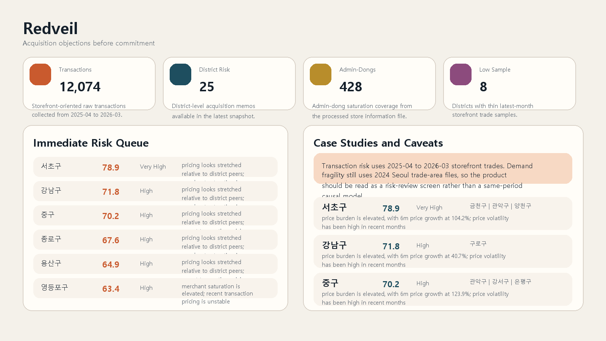
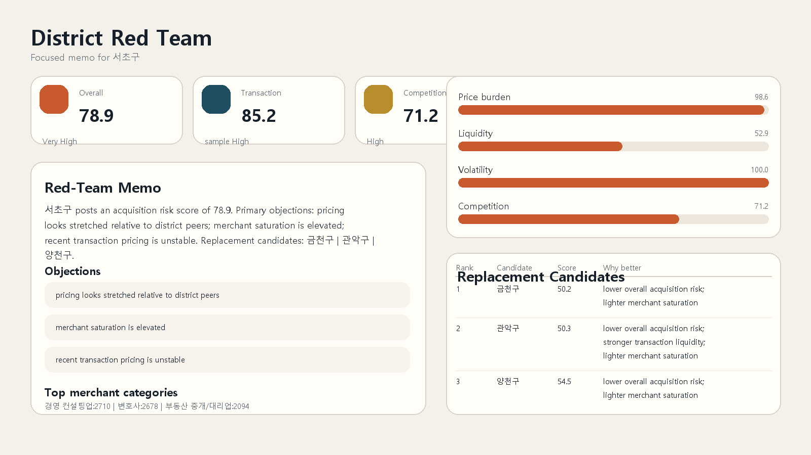
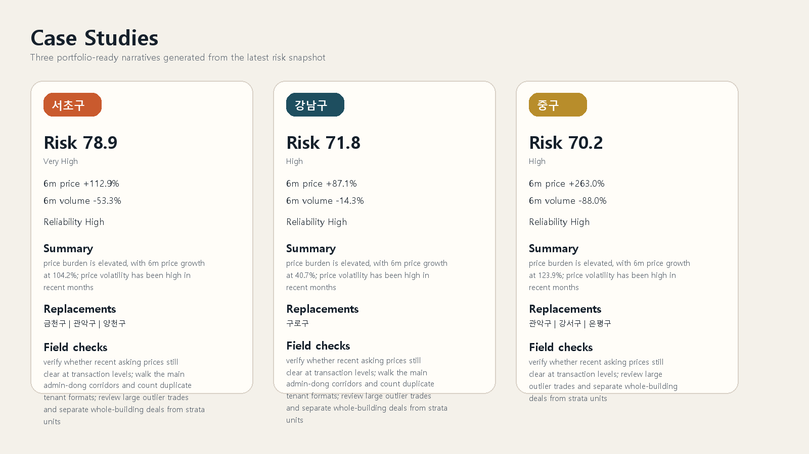

# 서울 상가 투자 레드팀

서울 소형 상가 투자자를 위한 `매입 판단 서비스` 프로젝트입니다.

이 프로젝트는 좋은 구를 추천하는 대신, `지금 사면 안 되는 근거`를 먼저 보여주는 방식으로 설계했습니다.  
가격 부담, 거래 유동성, 가격 변동성, 상권 과밀을 함께 보고 `매입 보류`, `강한 비교 필요`, `보수 검토` 같은 판단을 제공합니다.

## 웹사이트

- 저장소: [https://github.com/dffxonnb-cyber/seoul-storefront-red-team](https://github.com/dffxonnb-cyber/seoul-storefront-red-team)
- 공개 사이트 예정 주소: [https://dffxonnb-cyber.github.io/seoul-storefront-red-team/](https://dffxonnb-cyber.github.io/seoul-storefront-red-team/)

GitHub Pages가 아직 열리지 않으면 저장소의 `Settings > Pages`에서 배포 소스를 `GitHub Actions`로 한 번만 설정하면 됩니다.

## 대표 화면

### 메인 개요



### 구별 리포트



### 케이스 스터디



## 핵심 기능

- 구 단위 종합 매입 리스크 점수
- 리스크 유형 분류
- 3분 진단
- 대체 후보 비교
- 저장 가능한 매물 검토 메모
- 구별 리포트와 케이스 스터디
- 정적 공개 웹사이트 배포 지원

## 데이터 범위

- 국토교통부 상업업무용 실거래가
- 서울시 상권분석서비스(매출, 유동인구, 집객시설)
- 소상공인시장진흥공단 상가(상권)정보

주의:
원본 `data/` 폴더는 용량 문제로 GitHub 저장소에 포함하지 않았습니다.  
로컬에서 데이터를 다시 생성하거나 별도 원천 파일을 내려받아야 전체 파이프라인이 재현됩니다.

현재 기준 주요 커버리지는 다음과 같습니다.

- 실거래 원천 12,074건
- 서울 25개 구
- 행정동 428개
- 수요 취약 상권 1,570개

## 실행 방법

가상환경 설치:

```powershell
python -m venv .venv
.\.venv\Scripts\python -m pip install -r requirements.txt
```

웹사이트 payload 생성:

```powershell
.\.venv\Scripts\python .\src\redteam\pipelines\export_website_payload.py
```

로컬 서버 실행:

```powershell
.\.venv\Scripts\python .\app\server.py --host 127.0.0.1 --port 8030
```

접속 주소:

- [http://127.0.0.1:8030](http://127.0.0.1:8030)
- [http://127.0.0.1:8030/review.html](http://127.0.0.1:8030/review.html)
- [http://127.0.0.1:8030/assessment.html](http://127.0.0.1:8030/assessment.html)
- [http://127.0.0.1:8030/compare.html](http://127.0.0.1:8030/compare.html)
- [http://127.0.0.1:8030/districts.html](http://127.0.0.1:8030/districts.html)

## 테스트

```powershell
.\.venv\Scripts\python -m unittest discover -s tests
```

## 문서

- [서비스 전략](./docs/SERVICE_STRATEGY.md)
- [사용자 여정](./docs/USER_JOURNEY.md)
- [검증 전략](./docs/VALIDATION_STRATEGY.md)
- [PRD](./docs/PRD_RED_TEAM.md)
- [리스크 모델 정의](./docs/RISK_MODEL_SPEC.md)
