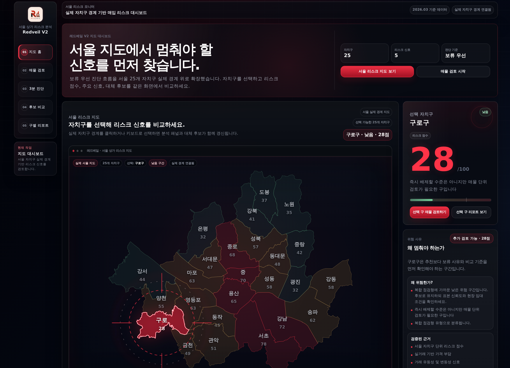
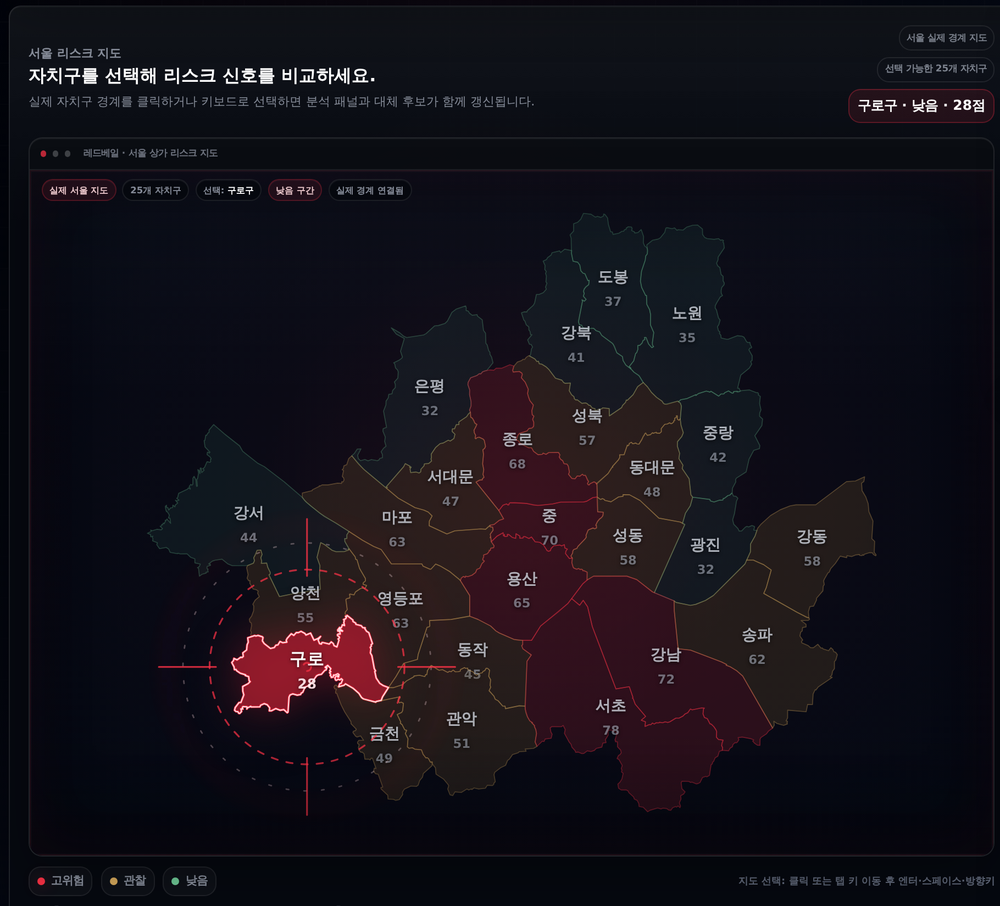
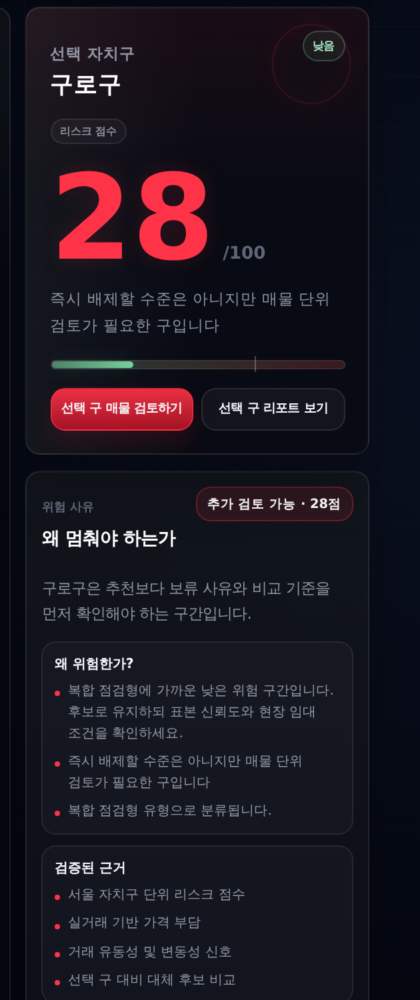
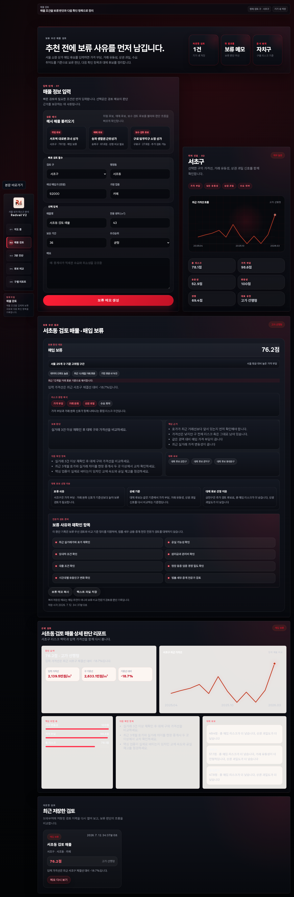
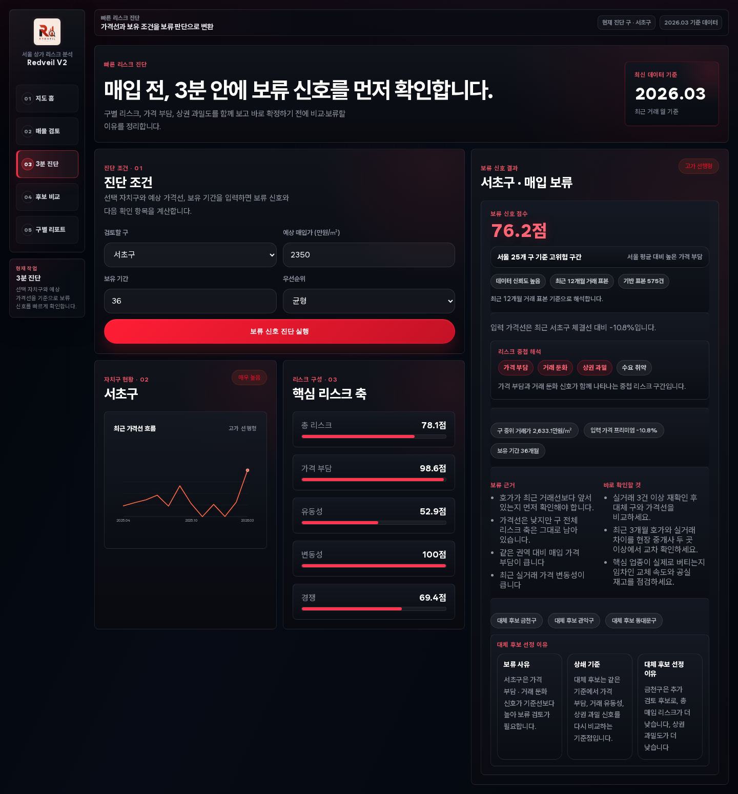
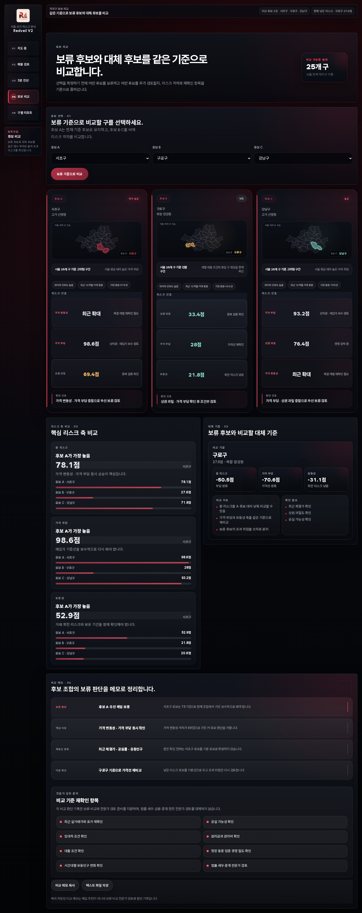
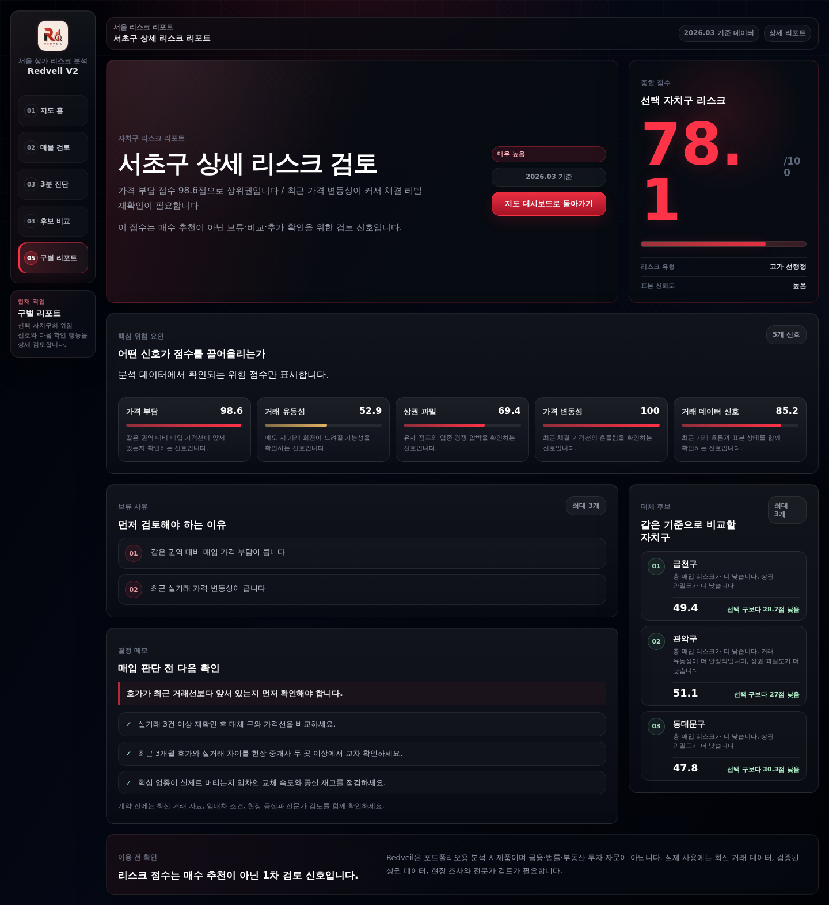
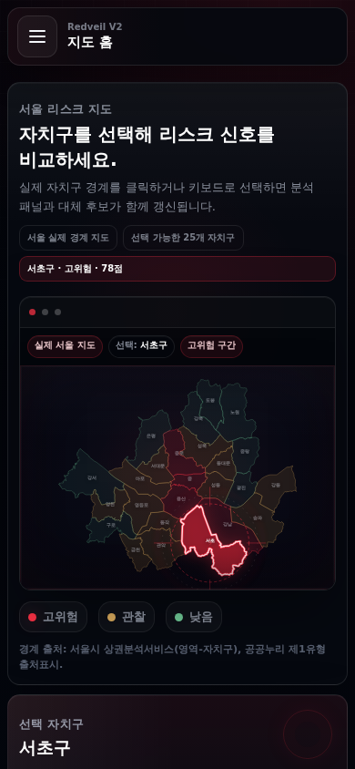
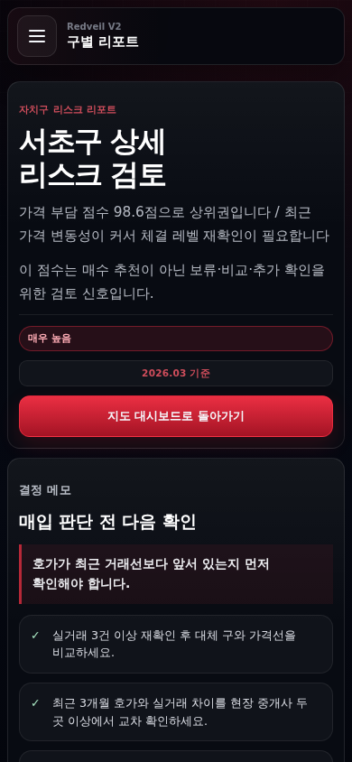

# Redveil V2

[](https://github.com/dffxonnb-cyber/Seoul-Storefront-Redveil/actions/workflows/deploy-pages.yml)
[](https://github.com/dffxonnb-cyber/Seoul-Storefront-Redveil/actions/workflows/refresh-public-data.yml)
[](https://dffxonnb-cyber.github.io/Seoul-Storefront-Redveil/v2/)
[](./VERIFY.md)

**서울 소형 상가 매입 전에 보류 사유와 비교 기준을 먼저 확인하는 지도 기반 리스크 분석 제품입니다.**

Redveil V2는 서울 자치구를 지도에서 선택한 뒤 리스크 점수와 위험 사유를 확인하고, 매물 검토·3분 진단·후보 비교·구별 리포트·판단 메모까지 하나의 흐름으로 연결합니다.

- 공식 대표 데모: **[GitHub Pages · Redveil V2](https://dffxonnb-cyber.github.io/Seoul-Storefront-Redveil/v2/)**
- 대체 배포: **[Vercel · Redveil V2](https://redveil.vercel.app/v2/)**
- V1은 기존 설명형 인터페이스를 보존한 **[Legacy 버전](https://dffxonnb-cyber.github.io/Seoul-Storefront-Redveil/)** 입니다.

## 대표 화면

[](https://dffxonnb-cyber.github.io/Seoul-Storefront-Redveil/v2/)

<p align="center"><sub>서울 자치구를 선택하면 리스크 점수, 핵심 반대 근거와 다음 검토 경로를 한 화면에서 확인합니다.</sub></p>

## 화면으로 보는 제품 흐름

화면을 기능별로 따로 나열하지 않고, 사용자가 실제로 판단하는 순서에 맞춰 연결했습니다. 이미지를 누르면 대응하는 공개 화면으로 이동합니다.

### 1. 지도에서 자치구 리스크를 먼저 확인

<table>
  <tr>
    <td width="68%"><a href="https://dffxonnb-cyber.github.io/Seoul-Storefront-Redveil/v2/"></a></td>
    <td width="32%"><a href="https://dffxonnb-cyber.github.io/Seoul-Storefront-Redveil/v2/"></a></td>
  </tr>
  <tr>
    <td align="center"><strong>서울 25개 자치구 리스크 지도</strong></td>
    <td align="center"><strong>점수·위험 사유·검증 근거</strong></td>
  </tr>
  <tr>
    <td align="center"><sub>지도에서 검토할 자치구를 직접 선택하고 같은 공간 단위로 위험 신호를 탐색합니다.</sub></td>
    <td align="center"><sub>점수만 보여주지 않고 왜 멈춰야 하는지와 무엇을 다시 확인해야 하는지 설명합니다.</sub></td>
  </tr>
</table>

### 2. 매물 조건을 검토하고 3분 진단으로 압축

<table>
  <tr>
    <td width="50%"><a href="https://dffxonnb-cyber.github.io/Seoul-Storefront-Redveil/v2/review.html?district=11650"></a></td>
    <td width="50%"><a href="https://dffxonnb-cyber.github.io/Seoul-Storefront-Redveil/v2/assessment.html?district=11650"></a></td>
  </tr>
  <tr>
    <td align="center"><strong>매물 검토</strong></td>
    <td align="center"><strong>3분 진단</strong></td>
  </tr>
  <tr>
    <td align="center"><sub>가격과 매물 조건을 입력해 보류 사유와 저장 가능한 판단 메모를 만듭니다.</sub></td>
    <td align="center"><sub>가격선·보유 기간·우선순위를 반영해 빠르게 재확인할 리스크를 정리합니다.</sub></td>
  </tr>
</table>

### 3. 후보를 같은 기준으로 비교하고 구별 리포트로 넘김

<table>
  <tr>
    <td width="50%"><a href="https://dffxonnb-cyber.github.io/Seoul-Storefront-Redveil/v2/compare.html?a=11650&b=11530&c=11680"></a></td>
    <td width="50%"><a href="https://dffxonnb-cyber.github.io/Seoul-Storefront-Redveil/v2/districts.html?district=11650"></a></td>
  </tr>
  <tr>
    <td align="center"><strong>후보 비교</strong></td>
    <td align="center"><strong>구별 리포트</strong></td>
  </tr>
  <tr>
    <td align="center"><sub>2~3개 자치구를 동일한 리스크 축으로 비교해 한 후보에 고정되지 않도록 돕습니다.</sub></td>
    <td align="center"><sub>핵심 위험 요인, 대체 후보와 다음 확인 항목을 하나의 검토 문맥으로 정리합니다.</sub></td>
  </tr>
</table>

### 4. 모바일에서도 같은 판단 흐름 유지

<table>
  <tr>
    <td width="50%"></td>
    <td width="50%"></td>
  </tr>
  <tr>
    <td align="center"><strong>지도 탐색</strong></td>
    <td align="center"><strong>구별 리포트·판단 메모</strong></td>
  </tr>
</table>

<p align="center"><sub>모바일에서도 자치구 선택부터 위험 사유 확인, 판단 메모까지 같은 흐름을 유지합니다.</sub></p>

## 3분 검토 경로

| 순서 | 화면 | 확인할 내용 |
| --- | --- | --- |
| 1 | [지도 홈](https://dffxonnb-cyber.github.io/Seoul-Storefront-Redveil/v2/) | 서울 25개 자치구 경계, 선택 구 리스크 점수와 위험 사유 |
| 2 | [매물 검토](https://dffxonnb-cyber.github.io/Seoul-Storefront-Redveil/v2/review.html?district=11650) | 매물 조건 입력, 보류 사유, 저장 가능한 판단 메모 |
| 3 | [3분 진단](https://dffxonnb-cyber.github.io/Seoul-Storefront-Redveil/v2/assessment.html?district=11650) | 가격선·보유 기간·우선순위를 반영한 빠른 리스크 진단 |
| 4 | [후보 비교](https://dffxonnb-cyber.github.io/Seoul-Storefront-Redveil/v2/compare.html?a=11650&b=11530&c=11680) | 2~3개 자치구의 동일 리스크 축 비교와 대체 기준 |
| 5 | [구별 리포트](https://dffxonnb-cyber.github.io/Seoul-Storefront-Redveil/v2/districts.html?district=11650) | 자치구 핵심 위험 요인, 대체 후보, 다음 확인 항목 |
| 6 | [V2 릴리스 증거](./docs/evidence/v2-release-2026-07-12.md) | 화면 캡처, 배포 경계, 데이터 범위, 검증 결과 |

## 제품이 지원하는 결정

> 이 매물을 바로 사기 전에 무엇 때문에 멈추고, 어떤 후보와 비교하며, 무엇을 다시 확인해야 하는가?

Redveil은 매입 추천이나 수익률 예측 대신 아래 판단을 지원합니다.

1. **지도에서 자치구 선택**
2. **리스크 점수와 핵심 반대 근거 확인**
3. **매물 조건을 넣어 보류 메모 생성**
4. **가격선·보유 기간을 반영한 3분 진단**
5. **대체 자치구와 같은 기준으로 비교**
6. **구별 리포트와 다음 확인 항목 정리**

선택한 자치구는 URL과 브라우저 저장 상태를 통해 V2 다섯 화면 사이에서 유지됩니다.

## 데이터 범위

현재 공개 배포 payload 기준:

- 거래 데이터: `2025.04~2026.03`
- 서울 상권 수요 데이터: `2025년 4분기`
- 점포 경쟁 데이터: `2026.03.31 기준 파일`
- 자치구: `25`
- 행정동: `427`
- 상권: `1,520`
- 거래: `12,074`
- 저표본 경고 자치구: `8`

주요 리스크 축:

- 가격 부담
- 거래 유동성
- 경쟁 밀도
- 가격 변동성
- 수요 취약성

점수는 검토 우선순위를 정리하기 위한 탐색 신호이며, 매수·매도 추천이나 투자 수익률 예측이 아닙니다.

## 구현 구조

| 영역 | 구현 |
| --- | --- |
| 프런트엔드 | Static HTML, CSS, JavaScript |
| 지도 | 서울 25개 자치구 GeoJSON을 SVG 경계 지도로 렌더링 |
| 제품 로직 | 클라이언트 리스크 해석, 후보 비교, 판단 메모 생성 |
| 상태 연결 | URL query + `localStorage` |
| 데이터 준비 | Python, pandas, 공개 배포 payload 생성 |
| 배포 | GitHub Pages, GitHub Actions, Vercel |
| 검증 | Python unittest, 정적 빌드, smoke check, Playwright Chromium E2E |

V2는 별도 지도 API나 서버 데이터베이스 없이 정적 배포 환경에서 동작합니다. 기존 V1의 검토·진단·비교 로직을 재사용하되, 모든 화면을 V2 공통 사이드바와 자치구 상태 흐름 안에 통합했습니다.

## 오류와 복구 상태

V2는 아래 상황에서 화면이 깨지지 않도록 사용자 안내와 복구 경로를 제공합니다.

- 잘못된 자치구 URL 코드
- 손상된 자치구 선택 저장값
- 손상된 매물 검토 저장 내역
- 브라우저 저장 기능 차단
- 분석 payload 누락
- 서울 경계 GeoJSON 연결 실패
- 구별 리포트 데이터 없음

## 반응형과 접근성

- 검증 너비: `360`, `390`, `430`, `768`, `1366+`
- 모바일·태블릿: 왼쪽 드로어 사이드바
- 주요 터치 영역: 최소 `44px`
- 모바일 입력 글자: 최소 `16px`
- 전체 페이지 가로 넘침 자동 검사
- 현재 화면 `aria-current`, 메뉴 `aria-expanded`, 상태 안내 `aria-live` 적용

## 검증

```bash
pip install -r requirements.txt
npm install
npm run build
python -m unittest discover -s tests -p "test_*.py"
python scripts/check_site_smoke.py
npx playwright test
```

`Deploy Pages` 워크플로는 `main`의 Python 테스트, payload 생성, 프런트 자산 검사, 런타임 검사, smoke check와 Chromium E2E를 통과한 뒤 `app/site`를 GitHub Pages에 배포합니다.

## 프로젝트 구조

| 경로 | 설명 |
| --- | --- |
| `app/site/v2/` | 공식 Redveil V2 제품 화면과 공통 셸 |
| `app/site/` | V1 Legacy 화면과 V2가 재사용하는 공통 로직 |
| `app/server.py` | 로컬 검증 서버와 경량 API endpoint |
| `src/redveil/` | 데이터 준비와 점수 산출 유틸리티 |
| `docs/` | 데이터·모델·제품·포트폴리오 문서 |
| `docs/evidence/` | 공개 배포 증거, 메타데이터, 화면 캡처 |
| `scripts/` | 빌드·자산·smoke·공개 사이트 검증 |
| `tests/` | Python 정적 검사와 Playwright E2E |

## 한계와 주장 범위

Redveil V2는 공개 데이터를 활용한 포트폴리오 제품이며 다음을 제공하지 않습니다.

- 투자 자문 또는 매수·매도 추천
- 수익률 예측
- 개별 건물의 정확한 공실·임대차·권리금·관리비 판단
- 법률·세무·금융·중개 자문
- 실시간 데이터 또는 개별 매물 정확성 보장
- 현장 조사와 전문가 검토의 대체

실제 의사결정에는 최신 실거래·호가, 임대차 조건, 공실 현황, 권리관계와 현장 조사를 별도로 확인해야 합니다.

## V1 Legacy

V1은 Redveil의 초기 설명형 제품 구조와 기존 기능을 보존합니다. 삭제하지 않지만, 공식 포트폴리오 대표 화면과 최신 기능 흐름은 V2입니다.

- [V1 Legacy 홈](https://dffxonnb-cyber.github.io/Seoul-Storefront-Redveil/)
- [V2 공식 홈](https://dffxonnb-cyber.github.io/Seoul-Storefront-Redveil/v2/)

## 관련 문서

- [V2 릴리스 증거](./docs/evidence/v2-release-2026-07-12.md)
- [Production evidence index](./docs/evidence/README.md)
- [데이터 출처](./docs/DATA_SOURCES.md)
- [리스크 검증](./docs/RISK_VALIDATION.md)
- [리스크 모델 명세](./docs/RISK_MODEL_SPEC.md)
- [사용자 여정](./docs/USER_JOURNEY.md)
- [검증 전략](./docs/VALIDATION_STRATEGY.md)
- [포트폴리오 사례 연구](./docs/portfolio-case-study.md)

## License

This project is licensed under the [MIT License](./LICENSE). Public data rights and usage conditions follow the policies of each original data provider.
