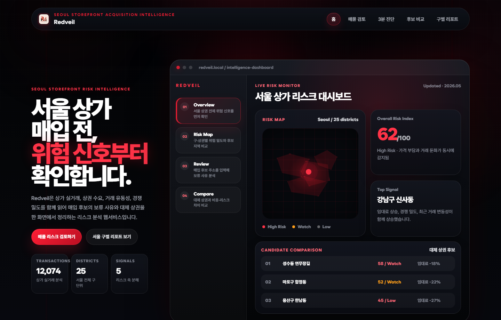
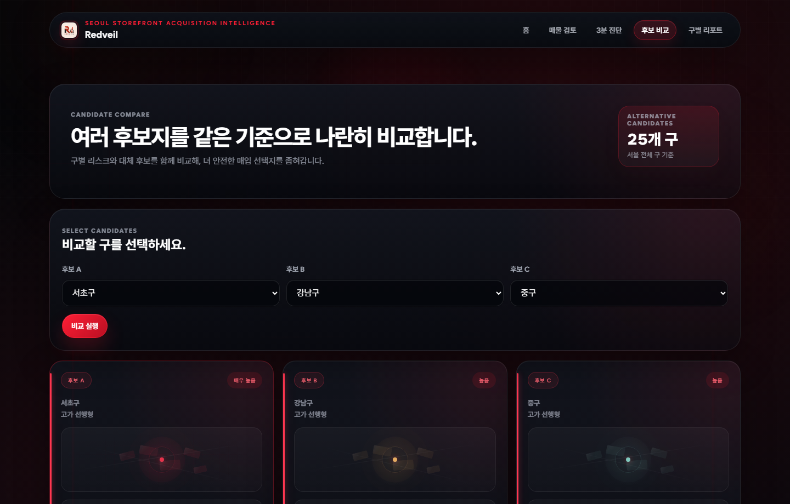
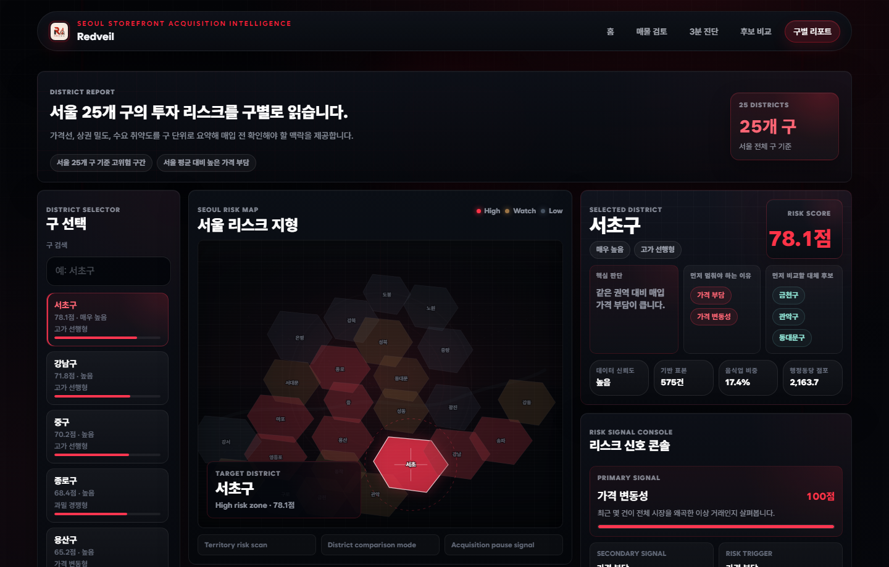

# Redveil

[](https://github.com/dffxonnb-cyber/Seoul-Storefront-Redveil/actions/workflows/deploy-pages.yml)
[](https://github.com/dffxonnb-cyber/Seoul-Storefront-Redveil/actions/workflows/refresh-public-data.yml)
[](https://dffxonnb-cyber.github.io/Seoul-Storefront-Redveil/)
[](./VERIFY.md)

> Seoul storefront acquisition risk analysis service using public commercial district and transaction data.

서울 소형 상가 매입 전, **추천보다 매입 보류 사유를 먼저 제시하는 투자 리스크 진단 웹서비스**입니다.  
공공데이터를 기반으로 가격 부담, 거래 유동성, 상권 과밀, 수요 취약도를 함께 분석하고, 대체 후보 지역까지 비교할 수 있도록 구현했습니다.

---

## 30-Second Reviewer Brief

| Reviewer Question | Redveil Answer |
| --- | --- |
| What problem does it solve? | 소형 상가 매입 전, 위험 신호가 큰 후보를 빠르게 걸러내고 보류·비교·현장 확인 판단을 돕습니다. |
| What makes it different? | 추천 중심이 아니라 **hold-first**, 즉 “왜 멈춰야 하는가”를 먼저 보여주는 판단 흐름입니다. |
| What data does it use? | 상업업무용 부동산 거래 12,074건, 서울 25개 구, 행정동 427개, 수요 취약 상권 1,520개를 사용했습니다. |
| What is the user flow? | 매물 검토 → 3분 진단 → 후보 비교 → 구별 리포트 순서로 리스크를 좁혀갑니다. |
| How is it verified? | 단위 테스트, 정적 페이지 검사, 서버/API smoke test, 브라우저 E2E, 반응형 QA, 공개 URL 검증을 포함했습니다. |

---

## Preview

### Redveil Overview



### Candidate Compare



### District Risk Report



---

## Live Service

- Live Site: [GitHub Pages](https://dffxonnb-cyber.github.io/Seoul-Storefront-Redveil/)
- Property Review: [review.html](https://dffxonnb-cyber.github.io/Seoul-Storefront-Redveil/review.html)
- 3-Minute Diagnosis: [assessment.html](https://dffxonnb-cyber.github.io/Seoul-Storefront-Redveil/assessment.html)
- Candidate Compare: [compare.html](https://dffxonnb-cyber.github.io/Seoul-Storefront-Redveil/compare.html)
- District Report: [districts.html](https://dffxonnb-cyber.github.io/Seoul-Storefront-Redveil/districts.html)

---

## Portfolio Summary

| Item | Description |
| --- | --- |
| Problem | 소형 상가 매입 전, 좋아 보이는 매물의 위험 신호를 빠르게 걸러내기 어렵다 |
| Product | GitHub Pages 기반 공개 웹서비스 |
| Coverage | 서울 25개 구, 행정동 427개, 수요 취약 상권 1,520개 |
| Transaction Data | 상업업무용 부동산 거래 원천 데이터 12,074건 |
| Main Output | 리스크 점수, 매입 보류 사유, 대체 후보, 구별 리포트 |
| Differentiation | 추천 중심이 아니라 **보류 사유 중심** 판단 흐름 설계 |
| Role | 문제 정의, 데이터 수집·가공, 리스크 지표 설계, 웹 화면 구현, 문서화 전부 수행 |

---

## Key Features

### 1. Risk Review Console

매물 1건을 입력하면 구별 리스크 맥락과 매입 조건을 함께 검토합니다.

- 매물명, 구, 행정동, 예상 매입가, 면적, 보유 기간, 우선순위 입력
- 리스크 점수와 매입 보류 판단 생성
- 보류 사유, 핵심 근거, 다음 확인 항목, 대체 후보를 메모 형태로 정리
- 브라우저 local storage 기반 검토 이력 저장

### 2. 3-Minute Diagnosis

빠른 입력만으로 1차 매입 보류 여부를 확인합니다.

- 검토 구, 예상 매입가, 보유 기간, 우선순위 기반 진단
- 가격 부담, 거래 유동성, 상권 과밀, 가격 변동성 신호 반영
- 선택 구의 최근 가격선 흐름과 핵심 리스크 축 제공

### 3. Candidate Compare

여러 후보 구를 같은 기준으로 나란히 비교합니다.

- 후보 A/B/C를 선택해 리스크 점수와 위험 신호 비교
- 후보별 Risk Signals, Decision Cue, 대체 후보 판단 제공
- 가장 안전한 기준 후보와 보류 우선 후보를 비교 메모로 정리

### 4. District Report

서울 25개 구의 리스크 지형을 한 화면에서 탐색합니다.

- 서울 리스크 지도
- 선택 구 상세 리포트
- 핵심 리스크 신호 콘솔
- 바로 확인할 것, 먼저 멈출 이유, 대체 후보
- 면적당 중위 거래가와 월별 거래 건수 추세

---

## Data & Risk Model

Redveil은 공공데이터를 활용해 구 단위 리스크를 산출합니다.

| Signal | Meaning |
| --- | --- |
| Price Burden | 같은 권역 대비 매입 가격선이 높게 형성되어 있는지 |
| Liquidity Risk | 거래 회전이 둔화되어 매각·보유 리스크가 커질 가능성 |
| Competition Risk | 상권 내 유사 업종 또는 점포 밀도가 과도한지 |
| Volatility Risk | 최근 거래 가격 변동성이 커 기준 가격 해석이 어려운지 |
| Demand Fragility | 상권 수요 기반이 약하거나 취약 신호가 있는지 |

Redveil의 점수는 투자 판단을 대신하는 최종 결론이 아니라,  
**매입 전 보류·비교·현장 확인이 필요한 후보를 빠르게 선별하기 위한 screening signal**입니다.

---

## Proof Points

- 고위험 보류, 애매 후보 비교, 보수 검토 후보를 포함한 고정 검증 케이스를 구성했습니다.
- 매물 검토 플로우는 예시 불러오기부터 저장 메모 생성까지 브라우저 E2E로 검증했습니다.
- 공개 사이트가 private local path 없이 재현될 수 있도록 public-safe payload와 검증 스크립트를 정리했습니다.
- 리스크 모델의 한계와 해석 범위를 문서화해, 점수가 투자 조언처럼 과잉 해석되지 않도록 했습니다.
- README 캡처 이미지는 Playwright 기반 자동 스크립트로 재생성할 수 있도록 관리했습니다.

---

## Verification

The project is designed to be reviewable without private local data.

```bash
python -m unittest discover -s tests -p "test_*.py"
python src/redveil/pipelines/export_website_payload.py
python scripts/check_site_smoke.py
python scripts/check_review_e2e.py
python scripts/check_service_flows_e2e.py
python scripts/check_responsive_pages.py
python scripts/check_public_site.py
```

`check_site_smoke.py` validates the local server, static pages, public payload, and core APIs.  
Browser checks require Node.js, Playwright, and a local Chrome/Edge runtime.

---

## Tech Stack

| Area | Stack |
| --- | --- |
| Data Collection & Processing | Python, pandas, requests |
| Risk Scoring | Python, custom scoring rules, public-safe payload generation |
| Frontend | HTML, CSS, JavaScript |
| Visualization | SVG, custom UI components, responsive dashboard layouts |
| Prototype / Internal Dashboard | Streamlit |
| Deployment | GitHub Pages, GitHub Actions |
| QA / Verification | unittest, smoke tests, browser E2E, Playwright screenshot capture |

---

## Project Structure

| Path | Description |
| --- | --- |
| `data/` | 원천 데이터와 중간 산출물 관리 |
| `notebooks/` | 분석 노트북 |
| `src/` | 데이터 파이프라인과 계산 로직 |
| `app/site/` | GitHub Pages로 배포되는 정적 웹사이트 |
| `app/server.py` | 로컬 검증용 서버 |
| `docs/` | PRD, 사용자 여정, 검증 전략, 리스크 모델 문서 |
| `docs/images/` | README용 자동 캡처 이미지 |
| `scripts/` | payload 생성, 검증, 캡처 자동화 스크립트 |
| `tests/` | 단위 테스트와 정적 페이지 검증 테스트 |

---

## Local Setup

### 1. Install Python dependencies

```bash
pip install -r requirements.txt
```

### 2. Generate website payload

```bash
python src/redveil/pipelines/export_website_payload.py
```

### 3. Run local server

```bash
python app/server.py --host 127.0.0.1 --port 8030
```

Windows에서는 아래 스크립트로 같은 흐름을 빠르게 실행할 수 있습니다.

```bash
run_site.bat
```

또는 PowerShell에서:

```powershell
.\run_site.ps1
```

### 4. Open local pages

```text
http://127.0.0.1:8030
http://127.0.0.1:8030/review.html
http://127.0.0.1:8030/assessment.html
http://127.0.0.1:8030/compare.html
http://127.0.0.1:8030/districts.html
```

---

## README Screenshot Regeneration

README preview images can be regenerated with Playwright.

### Install browser runtime

```bash
npm install
npx playwright install chromium
```

### Capture screenshots

```bash
node scripts/capture-readme-screenshots.mjs
```

Generated images are saved under:

```text
docs/images/
```

Main README images:

```text
docs/images/redveil-home.png
docs/images/redveil-compare.png
docs/images/redveil-districts.png
```

---

## My Role

개인 프로젝트로 아래 범위를 전부 직접 수행했습니다.

- 문제 정의와 서비스 콘셉트 설계
- 공공데이터 수집 및 가공 파이프라인 작성
- 리스크 점수 축 설계와 결과 payload 생성
- 웹사이트 정보 구조 설계
- HTML/CSS/JavaScript 기반 프론트엔드 구현
- 시각화 UI, 후보 비교 화면, 구별 리포트 화면 디자인 개선
- 검증 스크립트와 README 캡처 자동화 구성
- 문서 정리, 프로젝트 근거 요약, 배포 관리

---

## Limitations

- Redveil은 투자 자문 서비스가 아니라, 매입 전 리스크를 빠르게 확인하기 위한 screening tool입니다.
- 구 단위 지표는 개별 매물의 임대차 조건, 층수, 전면성, 권리금, 공실률, 현장 유동인구를 완전히 대체할 수 없습니다.
- 거래 표본이 적은 구는 점수 해석에 주의가 필요합니다.
- 최종 판단 전에는 실제 등기, 임대차 계약, 현장 답사, 전문가 검토가 필요합니다.

---

## References

- [프로젝트 개요](./docs/PROJECT_BRIEF.md)
- [포트폴리오 케이스 스터디](./docs/PORTFOLIO_CASE_STUDY.md)
- [데이터 출처와 업데이트 가이드](./docs/DATA_SOURCES.md)
- [서비스 전략](./docs/SERVICE_STRATEGY.md)
- [사용자 여정](./docs/USER_JOURNEY.md)
- [검증 전략](./docs/VALIDATION_STRATEGY.md)
- [리스크 검증 노트](./docs/RISK_VALIDATION.md)
- [PRD](./docs/PRD_REDVEIL.md)
- [리스크 모델 정의](./docs/RISK_MODEL_SPEC.md)
- [라이선스](./LICENSE)

---

## License

This project is licensed under the [MIT License](./LICENSE).  
Public data rights and usage conditions follow the policies of each original data provider.
