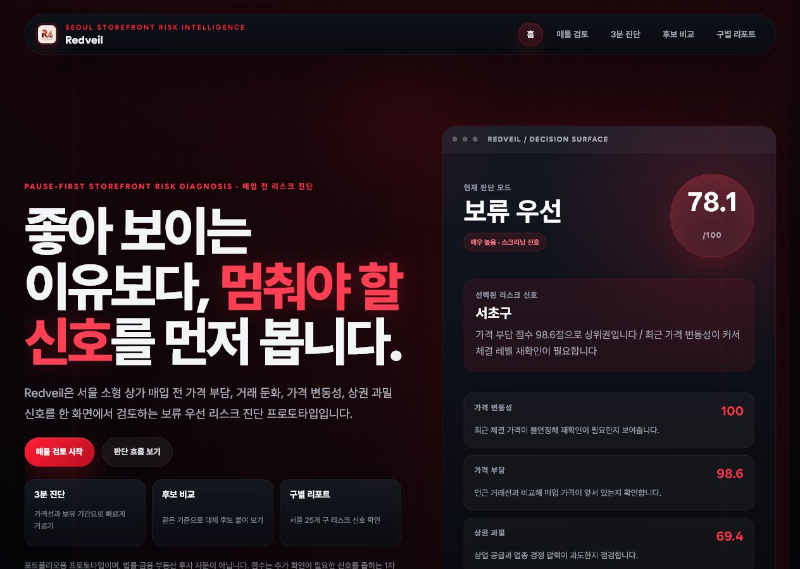
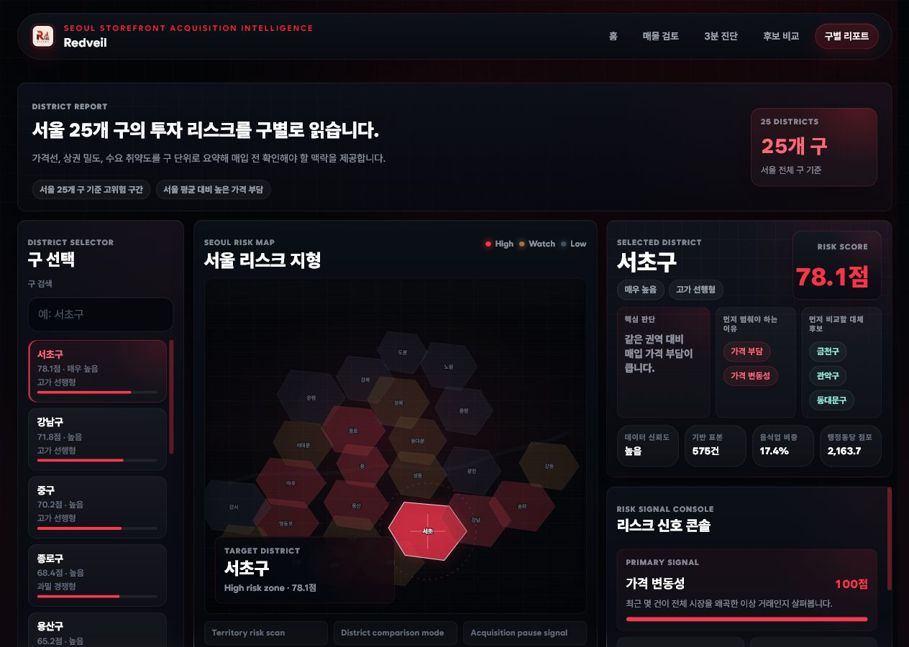

# Redveil

[](https://github.com/dffxonnb-cyber/Seoul-Storefront-Redveil/actions/workflows/deploy-pages.yml)
[](https://github.com/dffxonnb-cyber/Seoul-Storefront-Redveil/actions/workflows/refresh-public-data.yml)
[](https://dffxonnb-cyber.github.io/Seoul-Storefront-Redveil/)
[](./VERIFY.md)

Redveil is an interactive Seoul storefront risk diagnosis prototype that helps prospective buyers identify caution signals, compare alternative districts, and document why a purchase should be paused or reviewed.

It is a portfolio-ready frontend-first product prototype, not a production investment advisory service.

## 3-Minute Reviewer Path

| Step | Open | What to check |
| --- | --- | --- |
| 1 | [Live Home](https://dffxonnb-cyber.github.io/Seoul-Storefront-Redveil/) | Pause-first positioning and product surface |
| 2 | [Property Review](https://dffxonnb-cyber.github.io/Seoul-Storefront-Redveil/review.html) | Risk summary, caution signals, saved review memo |
| 3 | [Candidate Compare](https://dffxonnb-cyber.github.io/Seoul-Storefront-Redveil/compare.html) | Alternative district comparison and risk axes |
| 4 | [District Report](https://dffxonnb-cyber.github.io/Seoul-Storefront-Redveil/districts.html) | District-level interpretation and caution points |
| 5 | [Production Evidence](./docs/evidence/README.md) | Public-safe payload period, deployment proof, screenshot evidence |

## Decision Evidence Snapshot

| Question | Evidence |
| --- | --- |
| **What decision does it support?** | Before buying a small Seoul storefront, what should make the reviewer pause, compare, or escalate? |
| **What did I build?** | Static product experience with review, diagnosis, comparison, district report, and pause memo flows. |
| **What data boundary is public?** | Seoul 25 districts, 427 admin dongs, 1,520 trade areas, 12,074 transactions in the current public payload. |
| **What signals are interpreted?** | Price burden, liquidity risk, competition density, price volatility, and demand fragility. |
| **What is verified?** | Public GitHub Pages deployment, tracked public payload metadata, production screenshots, public-safe verification scripts. |
| **What is not claimed?** | No investment advice, return prediction, causal business outcome, or individual-property accuracy claim. |





## Portfolio Positioning

Shelter Signal demonstrates public-data pipeline, operational DB, API, and PWA architecture.

Redveil is intentionally different:

```text
Concept-driven product framing
-> interactive decision UX
-> risk interpretation
-> comparison and pause memo
-> portfolio storytelling
```

The product asks a narrower question:

> Before buying this small commercial property, what should make me pause?

## Live Product

- Primary live demo: [GitHub Pages](https://dffxonnb-cyber.github.io/Seoul-Storefront-Redveil/)
- Alternate deployment: [Vercel](https://redveil.vercel.app/)
- Property review: [review.html](https://dffxonnb-cyber.github.io/Seoul-Storefront-Redveil/review.html)
- 3-minute diagnosis: [assessment.html](https://dffxonnb-cyber.github.io/Seoul-Storefront-Redveil/assessment.html)
- Candidate compare: [compare.html](https://dffxonnb-cyber.github.io/Seoul-Storefront-Redveil/compare.html)
- District report: [districts.html](https://dffxonnb-cyber.github.io/Seoul-Storefront-Redveil/districts.html)

GitHub Pages is the representative URL because the repository's `Deploy Pages` workflow verifies and publishes `app/site` from `main`. Vercel remains a working alternate deployment. The core HTML pages were identical across both deployments when checked on 2026-06-15.

## V1 Workflow

1. The user lands on Redveil and understands the pause-first concept.
2. The user selects or reviews a Seoul district or storefront scenario.
3. Redveil shows a risk summary and factor breakdown.
4. The interface explains key caution signals.
5. The user compares alternative areas.
6. The user leaves with a review memo that explains why the purchase should be paused, compared, or escalated.

## Core Screens

| Screen | Purpose |
| --- | --- |
| Home | Explains the pause-first product concept and shows the decision surface. |
| Review | Turns one storefront scenario into a saved risk memo. |
| Diagnosis | Runs a quick district/price/holding-period check. |
| Compare | Places two or three districts on the same risk axes. |
| Districts | Provides a district-level risk report with caution points and alternatives. |

## Data And Logic Overview

Redveil uses public-safe, portfolio-oriented payloads derived from Seoul storefront transaction and commercial-area assumptions.

Current public payload:

- Transaction data: `2025.04~2026.03`
- Seoul commercial-district demand data: `2025년 4분기`
- Store competition data: `2026.03.31 기준 파일`
- Coverage: Seoul `25` districts, `427` admin dongs, `1,520` trade areas, `12,074` transactions

Main signal families:

- Price burden
- Liquidity risk
- Competition density
- Price volatility
- Demand fragility

The score is a screening signal for review priority. It is not an investment-return prediction and should not be interpreted as a buy/sell recommendation.

## Tech Stack

| Area | Stack |
| --- | --- |
| Frontend | Static HTML, CSS, JavaScript |
| Product logic | Client-side interpretation and local review state |
| Data preparation | Python, pandas, public-safe payload generation |
| Internal prototype | Streamlit |
| Deployment | GitHub Pages, GitHub Actions |
| QA | Python unittest, local smoke tests, Playwright-based browser checks |

## Project Structure

| Path | Description |
| --- | --- |
| `app/site/` | Static GitHub Pages product experience |
| `app/server.py` | Local verification server and lightweight API endpoints |
| `src/redveil/` | Data preparation and scoring utilities |
| `docs/` | Product, risk model, data source, and portfolio documentation |
| `docs/images/` | README screenshots |
| `scripts/` | Static-site, browser, public-site, and screenshot checks |
| `tests/` | Unit and static-page verification tests |

## Current Status

Redveil V1 is a polished portfolio product prototype.

Completed:

- Pause-first positioning
- Static public product site
- One clear review/diagnosis/compare workflow
- District-level risk interpretation
- Alternative candidate framing
- Decision memo concept
- Portfolio case study
- Local and public verification scripts

## Limitations

- Redveil is a portfolio prototype.
- It is not financial, legal, or real-estate investment advice.
- Risk signals are exploratory and based on available/static data assumptions.
- Real-world use would require updated transaction data, verified commercial-area data, professional review, and stronger validation.
- Building-level lease terms, vacancy, management costs, rights premium, tenant quality, and legal constraints are not fully modeled.

## Local Setup

Install Python dependencies:

```bash
pip install -r requirements.txt
```

Install Node dependencies for Playwright-based checks:

```bash
npm install
```

Run the local verification server:

```bash
python app/server.py --host 127.0.0.1 --port 8030
```

Open:

```text
http://127.0.0.1:8030
```

## Validation

```bash
git diff --check
npm run build
python -m unittest discover -s tests -p "test_*.py"
python scripts/check_site_smoke.py
```

Additional browser checks:

```bash
python scripts/check_review_e2e.py
python scripts/check_service_flows_e2e.py
python scripts/check_responsive_pages.py
```

Public deployment check:

```bash
python scripts/check_public_site.py
```

## Production Evidence

Public-safe Production evidence archived on 2026-06-15 KST:

- [Production verification summary](./docs/evidence/production-verification-2026-06-15.md)
- [Public payload metadata](./docs/evidence/public-payload-metadata-2026-06-15.json)
- [Deploy Pages PASS](./docs/evidence/deploy-pages-verification-2026-06-15.json)
- [Production home](./docs/evidence/redveil-production-home-2026-06-15.png)
- [Production district report](./docs/evidence/redveil-production-districts-2026-06-15.png)

The evidence verifies the public review surface, tracked payload period, and deployment boundary. It does not claim investment performance, causal business outcomes, individual-property accuracy, or complete upstream-data freshness.

## Portfolio Docs

- [Portfolio case study](./docs/portfolio-case-study.md)
- [Production evidence](./docs/evidence/README.md)
- [Data sources](./docs/DATA_SOURCES.md)
- [Risk validation](./docs/RISK_VALIDATION.md)
- [Risk model spec](./docs/RISK_MODEL_SPEC.md)
- [User journey](./docs/USER_JOURNEY.md)
- [Validation strategy](./docs/VALIDATION_STRATEGY.md)

## Portfolio Value

Redveil shows product thinking beyond data plumbing: framing an ambiguous decision, translating risk signals into UX, controlling claims, building a coherent visual identity, and giving a reviewer one complete workflow to understand quickly.

## License

This project is licensed under the [MIT License](./LICENSE). Public data rights and usage conditions follow the policies of each original data provider.
