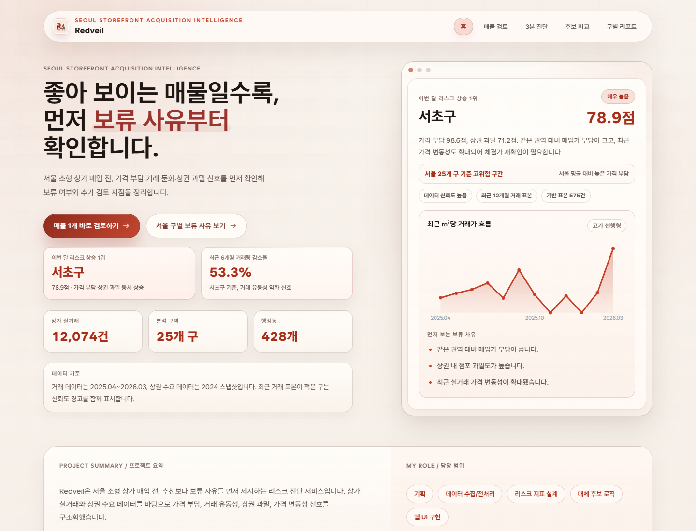
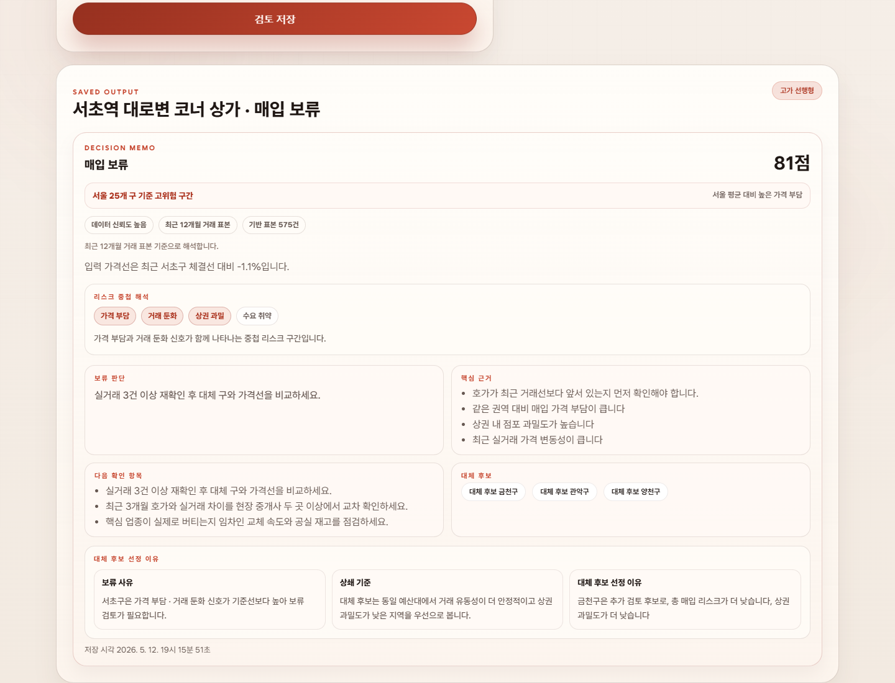
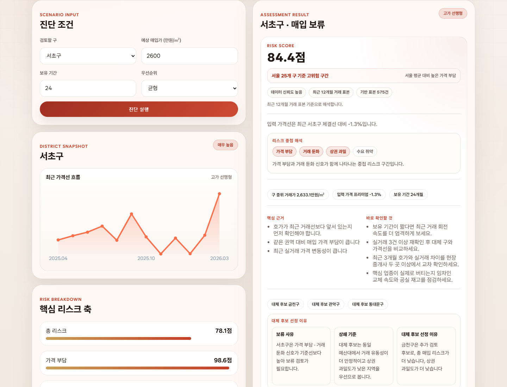
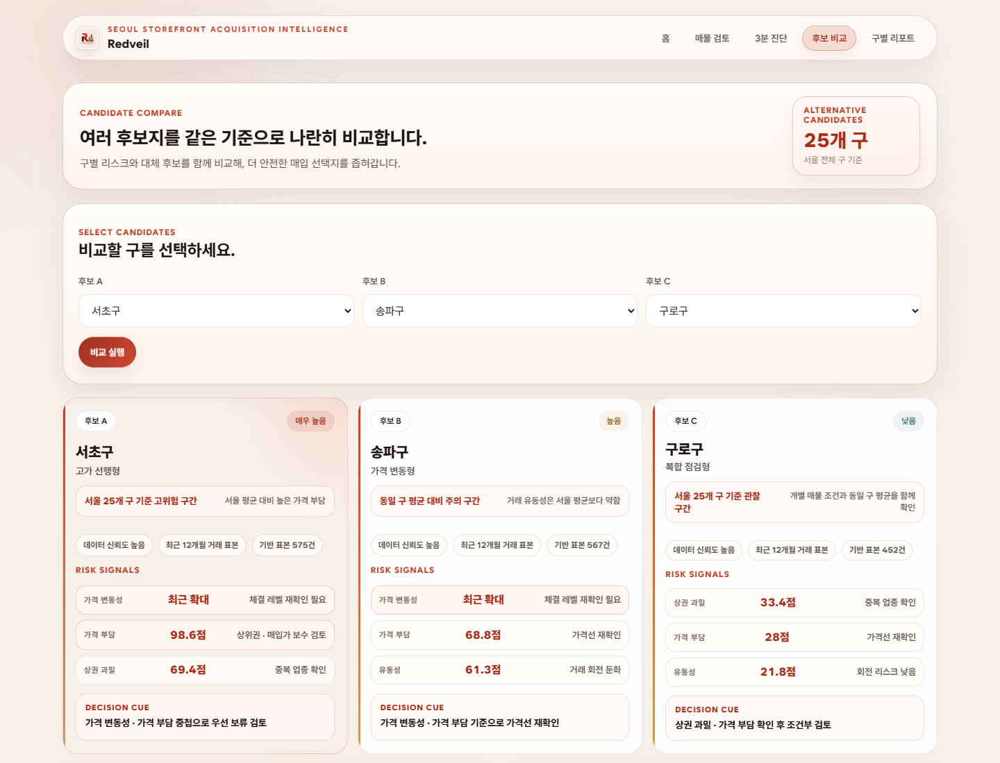
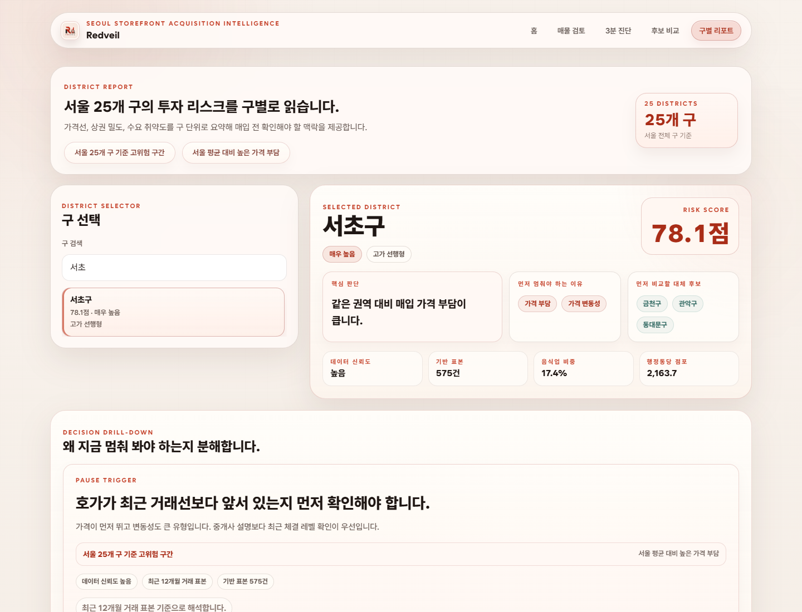

# Redveil Portfolio Case Study

## One-Line Summary

Redveil is a public web service that turns Seoul storefront transaction and commercial-district data into a hold-first acquisition risk memo: risk score, hold reason, evidence, next checks, and safer comparison candidates.

## Problem

Small storefront acquisitions often look attractive before the buyer has checked price stretch, liquidity, merchant saturation, and demand fragility together. Existing raw datasets are useful, but they are not phrased in the language of a buy-or-pause decision.

Redveil reframes the workflow from `what should I buy?` to `what should make me pause first?`

## Product Scope

| Area | Built Output |
| --- | --- |
| Property review | One property input produces a saved decision memo with score, evidence, next checks, and alternatives. |
| 3-minute diagnosis | District, price, holding period, and priority generate a fast risk verdict. |
| Candidate comparison | 2-3 districts are compared on the same risk axes with a safer baseline. |
| District report | Seoul districts can be searched and inspected with detail metrics, objections, and replacement candidates. |
| Public deployment | Static GitHub Pages site plus local API/server for richer verification. |

## Data Foundation

| Data Family | Role |
| --- | --- |
| 국토교통부 상업업무용 부동산 매매 실거래가 | Price level, transaction volume, volatility, and liquidity signals. |
| 서울시 상권분석서비스 | Estimated sales, floating population, attractor/facility and trade-area demand signals. |
| 소상공인시장진흥공단 상가(상권)정보 | Store density, category concentration, merchant saturation, and admin-dong competition context. |

Full update links and local file mapping are documented in [DATA_SOURCES.md](./DATA_SOURCES.md).

## Risk Model

The score is not an investment-return prediction. It is a screening score for `how strongly this deal should be paused and checked`.

| Layer | Composition |
| --- | --- |
| Price burden | Price level and price growth. |
| Liquidity | Transaction liquidity and recent transaction drop. |
| Transaction risk | Price burden, liquidity, and volatility. |
| Merchant saturation | Store count, food specialization, and category concentration. |
| Final acquisition risk | Transaction risk plus merchant saturation. |

Detailed weighting and interpretation bands are documented in [RISK_VALIDATION.md](./RISK_VALIDATION.md).

## Key Screens

### 1. Saved Property Review

The review flow fills an example property, saves a memo, and keeps it in browser storage for replay.

### 2. 3-Minute Diagnosis

The quick diagnosis converts district and price assumptions into a verdict and evidence stack.

### 3. Candidate Comparison

The comparison page separates the riskiest candidate from a safer baseline and explains the gap.

### 4. District Report

District pages expose the local risk profile, pause reasons, and alternative candidates.

## Verification

Redveil is verified in layers so the project can be reviewed without private local raw data.

| Check | Coverage |
| --- | --- |
| Unit tests | Scoring, payload examples, static page structure, path hygiene, UTF-8 Korean copy. |
| Site smoke | Local server, 5 HTML pages, public payload, bootstrap/content/assessment APIs. |
| Review browser E2E | Example click, form fill, save, history replay, persistence after reload. |
| Service browser E2E | 3-minute diagnosis, candidate comparison, district search/detail. |
| Responsive QA | 390px, 768px, and 1440px page rendering with no horizontal overflow. |
| Public deployment check | GitHub Pages pages, payload, current examples, and stale-deploy warnings. |

## My Role

- Problem framing and service strategy
- Public-data collection and transformation pipeline
- Risk-score design and interpretation copy
- Static web UI and local API
- Browser E2E, responsive QA, public deployment verification
- Portfolio documentation and source-traceability notes

## Known Limits

- The score is a first-pass screening signal, not an investment recommendation.
- Building-level lease terms, management cost, vacancy condition, tenant quality, and rights premium are not included.
- Seoul commercial-district demand data and transaction data can have different refresh cadences.
- District-level risk can hide admin-dong or street-level variation, so final decisions still need field checks.

## Next Data Update

The scheduled `Refresh Public Data` workflow checks the latest Seoul commercial-district and store-information files quarterly and opens a PR when tracked artifacts change. It also refreshes the MOLIT transaction window when the repository secret `PUBLIC_DATA_API_KEY` is configured; otherwise it keeps using the tracked public-safe transaction snapshot.
