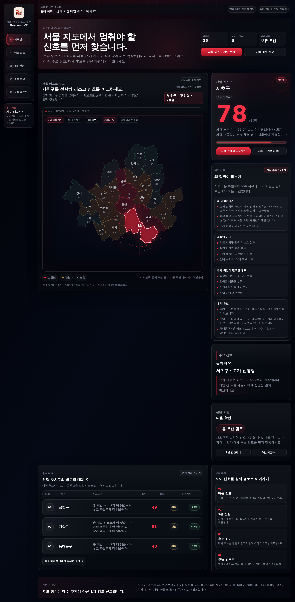
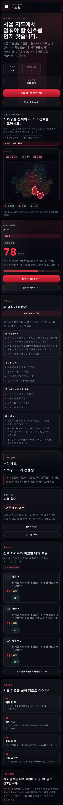

# Redveil V2 Release Evidence

Evidence date: **2026-07-12 KST**

Representative release: **Redveil V2**

## Official URLs

- GitHub Pages: https://dffxonnb-cyber.github.io/Seoul-Storefront-Redveil/v2/
- Vercel: https://redveil.vercel.app/v2/
- V1 Legacy: https://dffxonnb-cyber.github.io/Seoul-Storefront-Redveil/

## Product Flow

```text
서울 지도에서 자치구 선택
→ 리스크 점수와 위험 사유 확인
→ 매물 검토 또는 3분 진단
→ 대체 후보 비교
→ 구별 리포트
→ 보류·비교 판단 메모
```

V2 routes:

- `/v2/`
- `/v2/review.html`
- `/v2/assessment.html`
- `/v2/compare.html`
- `/v2/districts.html`

모든 화면은 같은 V2 사이드바와 상태 흐름을 사용합니다. 선택 자치구는 URL query와 `localStorage`를 통해 화면 사이에서 유지됩니다.

## Release Screenshots

### Desktop map dashboard



### Mobile map dashboard



### Property review


### 3-minute assessment


### Candidate compare


### District report


## Public Payload Boundary

Tracked public payload at release packaging time:

- Transaction period: `2025.04~2026.03`
- Commercial-district demand period: `2025년 4분기`
- Store competition file: `2026.03.31 기준`
- Districts: `25`
- Administrative dongs: `427`
- Trade areas: `1,520`
- Transactions: `12,074`
- Low-sample warning districts: `8`

Risk signal families:

- price burden
- liquidity risk
- competition density
- price volatility
- demand fragility

## Product Boundary

Supported:

- Seoul district boundary selection
- district-level risk score and explanation
- one-property review memo
- price/holding-period quick assessment
- two-to-three district comparison
- district report and alternative candidates
- copied/exported decision memo
- responsive desktop, tablet, and mobile layouts
- invalid URL, storage corruption, payload failure, and GeoJSON failure recovery

Not supported:

- individual property markers or address search
- real-time transaction or vacancy data
- building-level lease, rights premium, management fee, or legal verification
- investment recommendation
- return prediction
- legal, tax, financial, brokerage, or on-site professional advice

## Architecture Boundary

- Static HTML, CSS, JavaScript
- Seoul district GeoJSON rendered as SVG boundaries
- Existing V1 review/assessment/compare logic reused inside the V2 shell
- Python and pandas for public payload preparation
- URL query and browser storage for client state
- GitHub Pages and Vercel static deployment

No map API, login, server database, or real-time backend is required for the public V2 flow.

## Verification

The repository verification pipeline includes:

```bash
npm run build
python -m unittest discover -s tests -p "test_*.py"
python scripts/check_site_smoke.py
npx playwright test
```

Browser coverage includes:

- map → review → assessment → compare → district report → map state continuity
- invalid district code recovery
- corrupted review storage recovery
- missing public payload handling
- failed GeoJSON response handling
- mobile drawer behavior
- horizontal overflow checks at `360`, `390`, `430`, and `768px`
- Korean product-copy regression checks

## Claim Boundary

Redveil V2 is a public-safe portfolio product for pause-first risk review. It does not provide investment advice, buy/sell recommendations, return predictions, or individual-property accuracy guarantees. The result must be combined with current transaction prices, asking prices, lease conditions, vacancy checks, legal review, tax review, brokerage review, and on-site inspection before a real decision.
